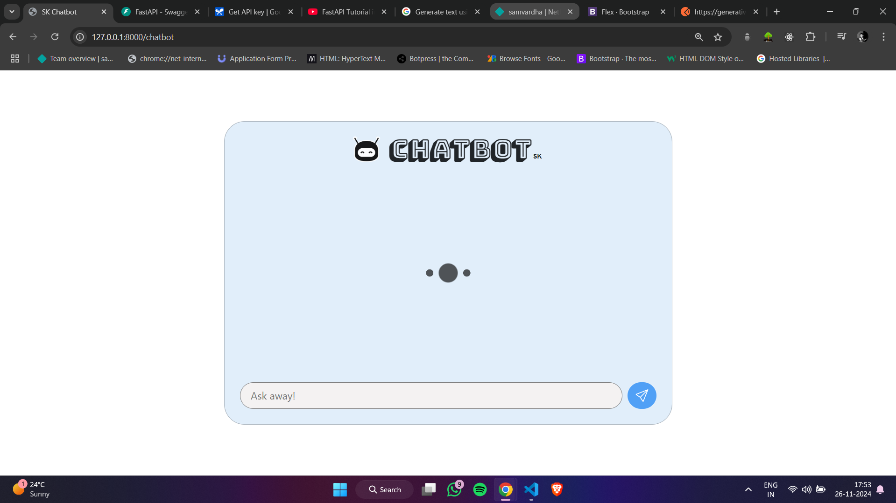
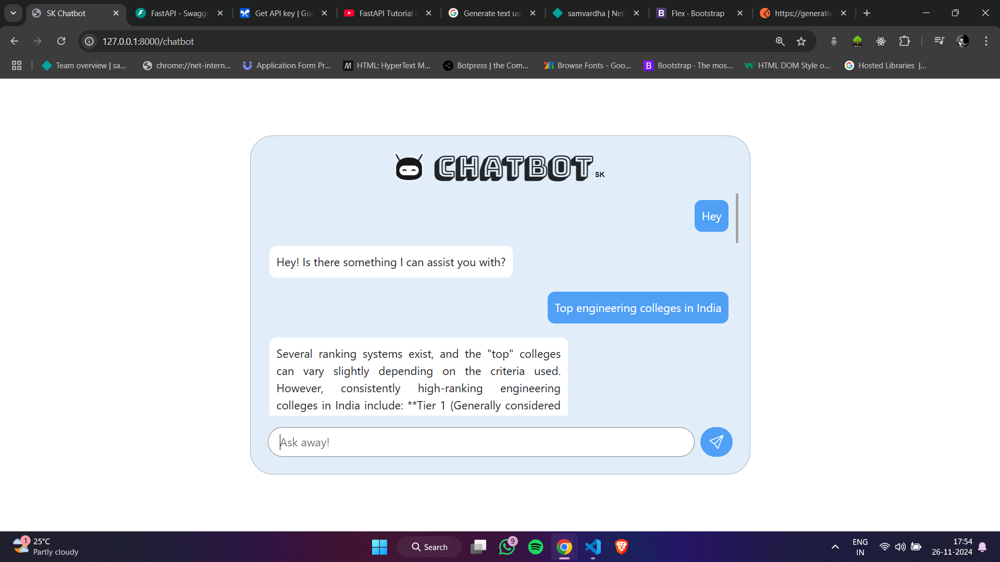
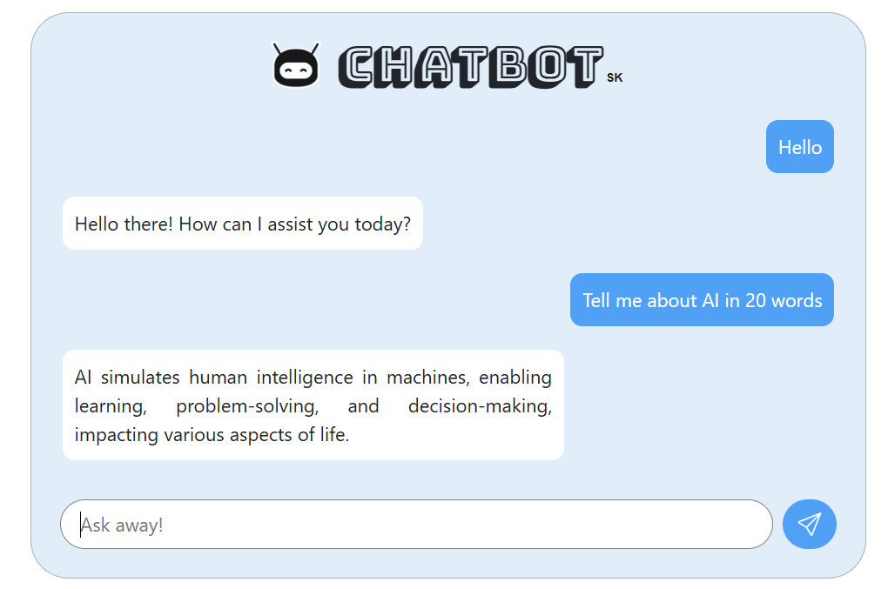

# [SK Chatbot 🔗](https://chatbotsk.vercel.app/chatbot)

Welcome to the SK Chatbot project! This is a simple chatbot application that allows users to interact with a chatbot interface, powered by FastAPI, providing a smooth and engaging chat experience.

## Table of Contents
- [Description](#description)
- [Features](#features)
- [Usage](#usage)
- [Screenshots](#screenshots)

## Description

SK Chatbot is a web-based application that connects a user interface with a backend API (FastAPI). The chatbot interacts with the user through messages displayed in a chatbox. The frontend is built with HTML, CSS (Bootstrap), and JavaScript. The backend is built with FastAPI, allowing it to handle chatbot responses.

## Features
- **User-Friendly Interface**: Clean and responsive design using Bootstrap.
- **Chat History**: Stores previous conversations in local storage for a smooth chat experience.
- **Cache Busting**: Ensures that POST requests work without caching issues.
- **Smooth Animations**: Custom loader and smooth scroll for a seamless experience.
- **Message Styling**: Distinct styling for user and bot messages.

## Screenshots

### Chatbot Interface

*Description: This is the main interface where users can interact with the chatbot.*

### User and Bot Messages

*Description: A sample of the conversation between the user and the chatbot, showing the distinct styling for user and bot messages.*
